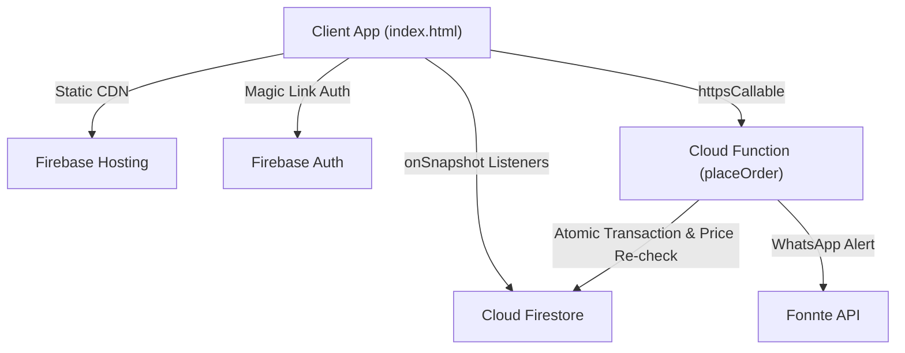

# eKasi Kota Hub — Firebase Backend Architecture

## The Core Principle

**Orders are created exclusively by the `placeOrder` Firebase Cloud Function.**
Direct client-side document creation on the `orders` Firestore collection is denied by `firestore.rules`. This guarantees that item prices are re-validated server-side from the `menu_items` collection and rate limits are strictly enforced.



## Security & Access Model

1. **Owners Collection (`/owners/{ownerId}`)**:
   - `read`: Public (allows customers to see shop open/closed status and wait times).
   - `write`: Restricted to the authenticated owner (`request.auth.uid == ownerId`).

2. **Menu Items (`/menu_items/{itemId}`)**:
   - `read`: Public for available items.
   - `write`: Restricted to the shop owner.

3. **Orders (`/orders/{orderId}`)**:
   - `create`: Disabled (`false` in rules). Orders must be submitted via `httpsCallable('placeOrder')`.
   - `read` / `update`: Restricted to the shop owner (`request.auth.uid == resource.data.owner_id`).

4. **Rate Limits & Order Counters**:
   - Closed to direct client access. Accessed strictly by Admin SDK inside Cloud Functions.

## Firebase Deployment Workflow

```bash
# 1. Install & Login
npx -y firebase-tools@latest login

# 2. Select / Create Project
npx -y firebase-tools@latest use <PROJECT_ID>

# 3. Deploy full stack
npx -y firebase-tools@latest deploy
```
